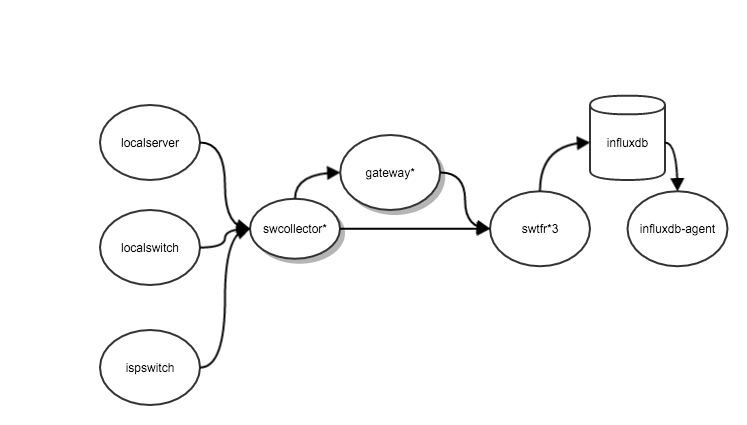

# 流量采集系统


## 介绍
流量采集系统负责采集所有服务器和交换机的流量数据，提供给资源平台用于展示和提供给监控平台用于监控。设计目标是99％无丢包，平台可以水平扩张。支持大量服务器和交换机。数据上传时间同节点数据为10s以内。数据查询时间，当前服务器数量情况下两个数据源并发查询一天的数据耗时为3s。

### 架构图



* 服务器采集为自发现方式进行采集，
* 交换机采集依据资源平台数据接口，自动采集本节点交换机或本isp交换机。
* 采集，中转和存储为平行备份方案，无中心节点。
* 查询接口支持并发往所有存储进行查询。提供查询效率。
* 存储支持集群模式。（数据量比较小，实际未部署成集群。influxdb在监控的系统上部署为集群是成功的。）

## 模块说明
### 依赖
* 所有模块依赖supervisor进行启动。请先用salt安装supervisor
* swcollector 依赖域名 swtfr.i.qingcdn.com 上传数据。请确保这个域名指向正确的gateway或swtfr服务器
* 依赖salt装机部署swcollector。
* 依赖iptables统计内外网流量。

### swcollector
**项目地址**：

**功能**：
* 自动采集本机内网流量数据
* 使用本地交换机获取接口 ，自动采集本节点交换机流量数据。
* 使用本ISP交换机获取接口 ，自动采集本ISP所有交换机的流量数据。


### gateway
**项目地址**： 

**功能**：
* 将采集上报的数据转到swtfr，解决跨运营商网络传输问题。
**部署方式**：
* 编译 `./control build`
* 解压到 /usr/local/open-falcon/falcon-gateway/ 目录
* 执行配置：`./control configlocal`
* 确保8433端口开放。
* 如果swtfr机器有变更，请修改默认配置的swtfr地址。


### swtfr
**项目地址**：

**功能**：
* 将采集上报的数据按照主备方式写入influxdb数据库。
**部署方式**：
* 编译 `./control build`
* 解压到 /usr/local/open-falcon/falcon-swtfr/ 目录
* 执行配置：`./control configlocal`
* 确保8433端口开放。
* 基本把swtfr ，influxdb 和 influxdb－agent部署在同一台机器。这台机器设置为采集专用机器。


### influxdb
**功能**：
* 保存所有采集数据。
* 提供influxql查询语句以获取对应服务器或交换机端口流量
**部署方式**：
* 安装

```
wget https://s3.amazonaws.com/influxdb/influxdb-0.10.1-1.x86_64.rpm
sudo yum localinstall influxdb-0.10.1-1.x86_64.rpm
```
* 修改配置：enable opentsdb接口
* 启动服务：`service influxdb start`
* 确保4242，8086，8088端口开放。

### influxdb-agent
**项目地址**：

**功能**：
* 提供一个并发的流量查询接口给资源平台
**部署方式**：
* 编译 `./control build`
* 解压到 /usr/local/influxdb-agent/ 目录
* 执行配置：`./control configlocal`
* 确保 端口开放。

## 可能问题
* 交换机IP采集依赖资源平台，故障切换很慢。

### 问题查找说明
* influxdb查询语句

```
influx  -database=opentsdb -precision=rfc3339  -execute "select * from opentsdb..\"switch.if.Out\" where time > now() - 10m and ip='AAA.AAA.AA.AAA'  and ifIndex='40' GROUP BY collecter, ifName,ifIndex ;"

```

* influx界面


* 日志查看 
```
./control tail   
tailf /var/log/influxdb/influxd.log
```

